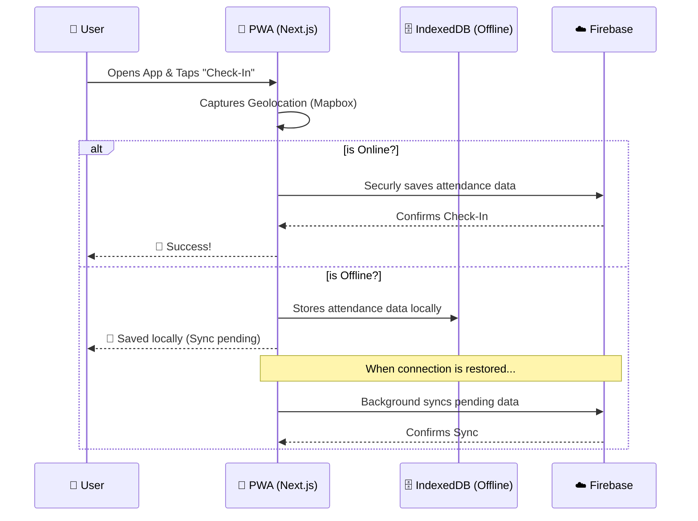

# 🗺️ Padam Attendance


Welcome to **Padam Attendance**, a next-generation attendance tracking application designed for seamless, location-aware check-ins with robust offline capabilities.

---

## 🎯 Our Motive

Traditional attendance systems are often rigid, require specialized hardware, or fail when the network goes down. 
**Our mission** is to provide an interactive, seamless, and reliable attendance experience that works everywhere. Whether you are in the office or on a remote site with poor connectivity, Padam Attendance ensures your check-in is securely recorded and synced.

---

## ⚙️ How It Works (Interactive Flow)

Here is a visual breakdown of how the Padam Attendance system operates under the hood:



### Key Features
- **🌍 Geolocation Check-ins:** Uses `mapbox-gl` and `react-map-gl` to verify the user's location during check-in.
- **📶 Offline-First Architecture:** Powered by `next-pwa` and `idb`, allowing users to check-in even without an active internet connection.
- **⚡ Real-time Sync:** Uses Firebase and Firebase Admin for secure, real-time database updates.
- **✨ Fluid UI/UX:** Built with Tailwind CSS, Radix UI, and Framer Motion for a beautiful, responsive, and animated user interface.

---

## 🚀 Getting Started

First, install the dependencies:

```bash
npm install
```

Set up your environment variables (Firebase config, Mapbox tokens, etc.) in `.env.local`, then run the development server:

```bash
npm run dev
```

Open [http://localhost:3000](http://localhost:3000) with your browser to see the app in action.

---

## 🛠️ Tech Stack

- **Framework:** [Next.js](https://nextjs.org/) (React 19)
- **Styling:** [Tailwind CSS v4](https://tailwindcss.com/)
- **Backend & Auth:** [Firebase](https://firebase.google.com/)
- **Maps:** [Mapbox GL](https://www.mapbox.com/)
- **Animations:** [Framer Motion](https://www.framer.com/motion/)
- **Offline Storage:** [IndexedDB (idb)](https://github.com/jakearchibald/idb)

---

*Developed with ❤️ to make attendance tracking as smooth as possible.*
